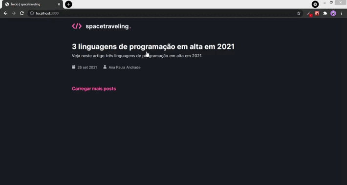

<h1 align="center">
  
</h1>

<p align="center">
     
</p>

<p align="center">
  <a href="#-tecnologias">Tecnologias</a>&nbsp;&nbsp;&nbsp;|&nbsp;&nbsp;&nbsp;
  <a href="#-projeto">Projeto</a>&nbsp;&nbsp;&nbsp;|&nbsp;&nbsp;&nbsp;
  <a href="#-projeto">Layout</a>&nbsp;&nbsp;&nbsp;|&nbsp;&nbsp;&nbsp;
  <a href="#-como-usar?">Como usar?</a>&nbsp;&nbsp;&nbsp;&nbsp;&nbsp;&nbsp;
</p>

## 🛠 Tecnologias 🚀

Este projeto foi desenvolvido com as seguintes tecnologias:

- <a href="https://nextjs.org/">Next.js</a>
- <a href="https://sass-lang.com/">SASS</a>
- <a href="https://www.typescriptlang.org/">Typescript</a>
- <a href="https://pt-br.reactjs.org/docs/hooks-intro.html">Hooks</a>
- <a href="https://react-icons.github.io/react-icons/">React-Icons</a>
- <a href="https://yarnpkg.com/">Yarn</a>
- <a href="https://github.com/utterance/utterances">Utterance</a>

## 💻 Projeto

Spacetraveling é um desafio proposto durante o chapter III ( módulo 3 ) do bootcamp ignite da rocketseat.

O desafio tem como principal objetivo a criação de um blog de notícias sobre tecnologia. Para o desenvolvimento foi disponibilizado uma aplicação praticamente em branco que deve assim consumir dados referentes aos posts contidos dentro do Prismic CMS e ter sua interface implementada conforme o layout do Figma. 

Durante o desenvolvimento foram implementados:

- Estilizações global, comun e individuais;
- Importação de fontes Google;
- Paginação de posts;
- Cálculo de tempo estimado de leitura do post;
- Geração de páginas estáticas com os métodos `getStaticProps` e `getStaticPaths`;
- Formatação de datas com `date-fns`;
- Uso de ícones com `react-icons`;
- Requisições HTTP com `fetch`;
- Integração com Headless CMS `Prismic`;
- Integração com o widget de comentários `Utterance`;
- Entre outros.

## 🔖 Layout

Você pode visualizar o layout do projeto através [desse link](https://www.figma.com/file/znjKS6vuwFBgLnFX0BavYh/Desafios-M%C3%B3dulo-3-ReactJS-(Copy)). É necessário ter conta no [Figma](https://figma.com) para acessá-lo.

## ⌨ Como usar?

Em primeiro lugar, clone o repositório:

```bash
# Clonando o repositório
git clone https://github.com/hitaloalvess/spacetraveling.git

# ✅ Em sequência:

# Instale as dependências:
yarn install

# Iniciando projeto
yarn dev
```

---
Made with ♥ by Hitalo 🚀